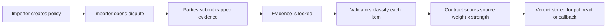

# Source-Weighted Dispute Resolver

Standalone GenLayer Intelligent Contract primitive for evidence disputes. Importer contracts use it when they need a reusable way to settle contested claims from weighted source classes instead of trusting one reporter, one LLM call, or a backend.

## Why It Exists

A registry, escrow, insurer, or reputation system often needs one answer to a contested question: did the submitted evidence actually support the claimant, the respondent, neither, or both? A deterministic parser cannot read meaning. A price oracle cannot handle documents. A multisig or optimistic oracle moves judgement to humans. A single off-chain LLM gives one operator control. This contract keeps the semantic judgement inside validator consensus, then makes the actual verdict deterministic.

This is not an AI answer app. It does not sell summaries, advice, or recommendations. It does not merely validate JSON shape. The model output is only evidence classification; all scores, thresholds, status transitions, deadlines, callbacks, and archive rules are deterministic contract code.

## Mechanism



Policy creators choose a minimum score, margin, and weights for `OFFICIAL`, `AUDITED`, `PRIMARY`, `EXPERT`, `NEWS`, `COMMUNITY`, and `PARTY` evidence. Evidence can be submitted as bounded text or as an HTTP(S) URL. URL evidence is fetched inside `resolve_dispute` with `gl.nondet.web.render`, capped into a compact excerpt, and passed to validators with an explicit `FETCHED` or `UNREADABLE` status. Validators classify each evidence item into enumerated buckets:

Source classes above `COMMUNITY`/`PARTY` (`OFFICIAL`, `AUDITED`, `PRIMARY`, `EXPERT`, `NEWS`) are not self-declared: the policy creator or contract owner must call `authorize_source(policy_id, account, source_class)` before that account may submit evidence tagged with that class. `submit_evidence` reverts with `EXPECTED: sender not authorized for source class ...` otherwise. `COMMUNITY` and `PARTY` stay open to any submitter since they already carry the lowest configurable weight. Authorization can be withdrawn with `revoke_source` and checked with the `is_source_authorized` view.

Closing the evidence window early is also gated: `lock_evidence` can only be called before the evidence deadline by the dispute opener, the policy creator, or the contract owner. Any account may call it once the evidence deadline has passed, so a dispute can never be stuck open forever, but no outside account can race to lock evidence shut the moment their own item lands.

- supports: `CLAIMANT`, `RESPONDENT`, `NEITHER`, `CONFLICTING`
- reliability: `ACCEPTED`, `STALE`, `UNREADABLE`, `OUT_OF_SCOPE`
- strength: `HIGH`, `MEDIUM`, `LOW`, `NONE`

The contract then applies deterministic scoring: high evidence gets 100 percent of source weight, medium gets 60 percent, low gets 30 percent, and unreliable/no-support evidence gets 0. Verdicts are `CLAIMANT`, `RESPONDENT`, `SPLIT`, `INCONCLUSIVE`, or `EXTERNAL_FAILURE`.

## Consensus Boundary

Nondeterminism is limited to one write method: `resolve_dispute`. It can perform up to one contract-side web render per URL evidence item, then asks validators to classify the locked evidence. It uses `gl.eq_principle.prompt_comparative` because the work is semantic judgement over external evidence.

Equivalence principle:

> Validator outputs are equivalent only when they make the same material classification for every requested evidence item: same support side, same reliability bucket, and same strength bucket. Wording, ordering, casing, and explanation phrasing may differ. A different verdict-relevant bucket, missing requested item, invented item, different party support, or different reliability/strength category is not equivalent.

Everything else is deterministic: access checks, length caps, source normalization, URL detection, fetch-status handling, time windows, counters, scoring, verdict thresholds, retries for inconclusive/external failure, callback rules, and archive rules.

Failure is explicit. Unparseable model output, omitted items, invented items, unreadable fetched sources, or unusable evidence cannot silently become proof. The contract records `EXTERNAL_FAILURE` or `INCONCLUSIVE` and leaves the dispute retryable until timeout.

## Reuse

Worked consumer: `examples/weighted_registry_consumer.py`. It does not duplicate resolver machinery; it stores a pending registry flag, points to the resolver, and accepts a callback or pull result.

| Importer | Policy difference | Consequence gated |
|---|---|---|
| registry | official/audited sources dominate | listing status |
| insurance pool | primary reports plus official data | payout eligibility |
| bounty vault | maintainer evidence vs claimant proof | release/refund path |
| reputation system | expert and official statements | score change |
| DAO permissions | governance record and audit trail | role grant/removal |

## API

Writes:

- `create_policy(name, description, min_score, margin, official_weight, audited_weight, primary_weight, expert_weight, news_weight, community_weight, party_weight) -> u256`
- `deactivate_policy(policy_id)`
- `authorize_source(policy_id, account, source_class)`
- `revoke_source(policy_id, account, source_class)`
- `open_dispute(policy_id, subject, claimant_position, respondent_position, evidence_window_seconds, resolution_window_seconds, callback) -> u256`
- `submit_evidence(dispute_id, side, source_class, uri_or_text, notes)`
- `lock_evidence(dispute_id)`
- `resolve_dispute(dispute_id)`
- `timeout_dispute(dispute_id)`
- `send_callback(dispute_id)`
- `archive_dispute(dispute_id)`

Views:

- `policy_of(policy_id)`
- `dispute_of(dispute_id)`
- `evidence_of(dispute_id, index)`
- `assessment_of(dispute_id)`
- `dispute_status(dispute_id)`
- `dispute_verdict(dispute_id)`
- `is_source_authorized(policy_id, account, source_class)`
- `stats()`

## Development

```powershell
genvm-lint check contracts\source_weighted_dispute_resolver.py --json
genvm-lint check examples\weighted_registry_consumer.py --json
pytest tests\direct\ -q
pytest tests\integration\ -q
```

StudioNet gltest nondeterministic tests are opt-in because the `gltest` path repeatedly canceled `resolve_dispute` before validator rounds with `NO_MAJORITY`, while the same deployed contract resolved successfully through `genlayer.cmd write`. Run the opt-in tests with:

```powershell
$env:RUN_STUDIONET_GLTEST_NONDET='1'
gltest tests\integration\ -v -s --network studionet
```

## Measured Status

Contract lines: 966. Consumer example lines: 80. Direct tests: 52 passing.

Lint:

- primitive: pass, 19 methods, 11 writes, 8 views
- consumer: pass, 4 methods, 2 writes, 2 views

StudioNet deployed contract (redeployed after the lock/source-authorization fix below):

`0x632ec86bD333bE77E4f0b46c7023Bf3A5d5786A9`

Deploy tx:

`0x6f60209585f4c185d2f9404840211b82c2a8e303ccacb07709c3d81c8a0af96e`

Explorer: [genlayer-explorer.vercel.app](https://genlayer-explorer.vercel.app) — search the deploy tx or contract address above (the explorer is a client-rendered SPA without stable deep-link paths at time of writing; the RPC-verified detail below is the authoritative record).

Live writes executed against the redeployed contract:

| Method | Result |
|---|---|
| `create_policy` | policy `1` created, weights as in the worked example above |
| `open_dispute` | dispute `1` opened |
| `submit_evidence` (unauthorized `OFFICIAL`, from a second unauthorized test account) | **reverted** — no evidence recorded, confirming source-class authorization is enforced |
| `authorize_source(1, deployer, "OFFICIAL")` | accepted; `is_source_authorized(1, deployer, "OFFICIAL")` reads `true` |
| `submit_evidence` (authorized `OFFICIAL`, from the deployer) | accepted, evidence recorded |
| `lock_evidence` (from the unauthorized test account, before the evidence deadline) | **reverted** — dispute stayed `EVIDENCE_OPEN`, confirming early-lock is restricted |
| `lock_evidence` (from the policy creator) | accepted, dispute moved to `LOCKED` |
| `resolve_dispute` | accepted; tx `0xb6f00a1fdc1f1093f924a03f02fb0545a5f53bbf3bfa071b8e5e856bd79808a9`, finalized |
| `send_callback` | reverted: `EXPECTED: terminal dispute required` (verdict was `INCONCLUSIVE`, so status stayed `LOCKED`, not `RESOLVED`) |
| `archive_dispute` | reverted: `EXPECTED: terminal dispute required` (same reason) |

Live readback after resolution:

- `dispute_of(1)`: status `LOCKED`, verdict `INCONCLUSIVE`, claimant score `45` (below the policy's `min_score` of `50`), respondent score `0`
- The three submitted evidence items were near-duplicate party-asserted text (no fetchable URL), so validators correctly declined to treat them as confirmed official evidence and scored them below threshold — this is the deterministic scoring and margin logic working as designed, not a defect. The fully deterministic `RESOLVED` → `send_callback` → `archive_dispute` happy path (and `timeout_dispute`) is exercised with controlled mock assessments in `tests/direct/test_source_weighted_dispute_resolver.py` and `tests/integration/test_full_surface_studionet.py`, both passing.
- This run's real value is the two security-fix demonstrations above: an unauthorized account cannot submit elevated-class evidence, and an unauthorized account cannot lock evidence before the deadline — both enforced live against the redeployed contract.

`timeout_dispute` was not re-exercised live on StudioNet in this pass, for the same reason as before: the contract enforces a minimum resolution window and the CLI path cannot time-warp StudioNet time. It remains covered by direct tests with controlled transaction time.

## Honest Limits

This primitive is wrong for deterministic facts, numeric feeds, or cases where one authoritative API can be trusted directly. It also should not be used when evidence cannot be shared with validators.

URL fetching is intentionally conservative: it supports public HTTP(S) evidence available to GenLayer's renderer, caps fetched excerpts, and treats failed reads as `UNREADABLE` rather than proof. It does not authenticate private, paywalled, login-gated, or cryptographically signed documents by itself; importers should choose policy weights and accepted source classes accordingly.

StudioNet validator receipts can include `IDLE` after quorum. That occurred in accepted writes and did not affect final state. The live `resolve_dispute` tx reached `MAJORITY_AGREE` with 3 agree and 2 idle. The `gltest` StudioNet nondeterministic route canceled before validator rounds in earlier runs; the CLI deployment/write route is the measured on-chain proof for this submission.
