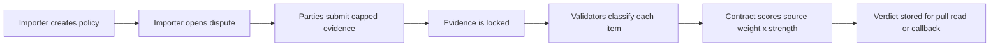

# Source-Weighted Dispute Resolver

Standalone GenLayer Intelligent Contract primitive for evidence disputes. Importer contracts use it when they need a reusable way to settle contested claims from weighted source classes instead of trusting one reporter, one LLM call, or a backend.

## Why It Exists

A registry, escrow, insurer, or reputation system often needs one answer to a contested question: did the submitted evidence actually support the claimant, the respondent, neither, or both? A deterministic parser cannot read meaning. A price oracle cannot handle documents. A multisig or optimistic oracle moves judgement to humans. A single off-chain LLM gives one operator control. This contract keeps the semantic judgement inside validator consensus, then makes the actual verdict deterministic.

This is not an AI answer app. It does not sell summaries, advice, or recommendations. It does not merely validate JSON shape. The model output is only evidence classification; all scores, thresholds, status transitions, deadlines, callbacks, and archive rules are deterministic contract code.

## Mechanism



Policy creators choose a minimum score, margin, and weights for `OFFICIAL`, `AUDITED`, `PRIMARY`, `EXPERT`, `NEWS`, `COMMUNITY`, and `PARTY` evidence. Validators classify each evidence item into enumerated buckets:

- supports: `CLAIMANT`, `RESPONDENT`, `NEITHER`, `CONFLICTING`
- reliability: `ACCEPTED`, `STALE`, `UNREADABLE`, `OUT_OF_SCOPE`
- strength: `HIGH`, `MEDIUM`, `LOW`, `NONE`

The contract then applies deterministic scoring: high evidence gets 100 percent of source weight, medium gets 60 percent, low gets 30 percent, and unreliable/no-support evidence gets 0. Verdicts are `CLAIMANT`, `RESPONDENT`, `SPLIT`, `INCONCLUSIVE`, or `EXTERNAL_FAILURE`.

## Consensus Boundary

Nondeterminism is limited to one block: `resolve_dispute` asks validators to classify the locked evidence. It uses `gl.eq_principle.prompt_comparative` because the work is semantic judgement.

Equivalence principle:

> Validator outputs are equivalent only when they make the same material classification for every requested evidence item: same support side, same reliability bucket, and same strength bucket. Wording, ordering, casing, and explanation phrasing may differ. A different verdict-relevant bucket, missing requested item, invented item, different party support, or different reliability/strength category is not equivalent.

Everything else is deterministic: access checks, length caps, source normalization, time windows, counters, scoring, verdict thresholds, retries for inconclusive/external failure, callback rules, and archive rules.

Failure is explicit. Unparseable model output, omitted items, invented items, or unusable evidence cannot silently become proof. The contract records `EXTERNAL_FAILURE` or `INCONCLUSIVE` and leaves the dispute retryable until timeout.

## Reuse

Worked consumer: `examples/weighted_registry_consumer.py`. It does not duplicate resolver machinery; it stores a pending registry flag, points to the resolver, and accepts a callback or pull result.

| Importer | Policy difference | Consequence gated |
|---|---|---|
| registry | official/audited sources dominate | listing status |
| insurance pool | primary reports plus official data | payout eligibility |
| bounty vault | maintainer evidence vs claimant proof | release/refund path |
| reputation system | expert and official statements | score change |
| DAO permissions | governance record and audit trail | role grant/removal |

## API

Writes:

- `create_policy(name, description, min_score, margin, official_weight, audited_weight, primary_weight, expert_weight, news_weight, community_weight, party_weight) -> u256`
- `deactivate_policy(policy_id)`
- `open_dispute(policy_id, subject, claimant_position, respondent_position, evidence_window_seconds, resolution_window_seconds, callback) -> u256`
- `submit_evidence(dispute_id, side, source_class, uri_or_text, notes)`
- `lock_evidence(dispute_id)`
- `resolve_dispute(dispute_id)`
- `timeout_dispute(dispute_id)`
- `send_callback(dispute_id)`
- `archive_dispute(dispute_id)`

Views:

- `policy_of(policy_id)`
- `dispute_of(dispute_id)`
- `evidence_of(dispute_id, index)`
- `assessment_of(dispute_id)`
- `dispute_status(dispute_id)`
- `dispute_verdict(dispute_id)`
- `stats()`

## Development

```powershell
genvm-lint check contracts\source_weighted_dispute_resolver.py --json
genvm-lint check examples\weighted_registry_consumer.py --json
pytest tests\direct\ -q
pytest tests\integration\ -q
```

StudioNet gltest nondeterministic tests are opt-in because the `gltest` path repeatedly canceled `resolve_dispute` before validator rounds with `NO_MAJORITY`, while the same deployed contract resolved successfully through `genlayer.cmd write`. Run the opt-in tests with:

```powershell
$env:RUN_STUDIONET_GLTEST_NONDET='1'
gltest tests\integration\ -v -s --network studionet
```

## Measured Status

Contract lines: 780. Consumer example lines: 80. Direct tests: 40 passing.

Lint:

- primitive: pass, 16 methods, 9 writes, 7 views
- consumer: pass, 4 methods, 2 writes, 2 views

StudioNet deployed contract:

`0x897B810490a1e7E701D30D52067f21cccee5Db22`

Deploy tx:

`0xfe174c82ea0a75665b50371ebb00f3666d44ec1a485c3b0a67f871a3ed5042e6`

Live writes executed:

| Method | Tx | Result |
|---|---|---|
| `create_policy` | `0x2533ae50a32e477e78a1bed00ea70cabc5110eddabc73ff456ad0b94860c512d` | policy `1`, accepted |
| `open_dispute` | `0xba647b25148505bf705e07b812dcf57e8e0256beb8e449e2c47d8024c55a7d9b` | dispute `1`, accepted |
| `submit_evidence` | `0x66e71001fd54bdbe164c1bcb3115383fa10607a61407123b76d7f39f7f8a7630` | accepted |
| `lock_evidence` | `0xc1c957867fd1e0a7fc7d768490d7cb2d84d592b818fce2c88b1b71a08a53b1cc` | accepted |
| `resolve_dispute` | `0x04d68bf3b617d318ed07cb445583942dd2f83d367ab335128c8990f519b2d033` | accepted, verdict `CLAIMANT` |
| `send_callback` | `0x3bd5ddf396e6dad37df6bbb106bc6680fbb995ae7b411cabe559901e2e341d38` | expected rollback: `EXPECTED: no callback` |
| `archive_dispute` | `0x55245a3c5376a47e5f5fc7213923577d5813de4e186575e18a78659eb7daaaf9` | accepted |
| `create_policy` | `0x26284310db3d503177c499448fe09076b938cb173a6a07bd1d1dcba6c3da7db1` | policy `2`, accepted |
| `deactivate_policy` | `0xe083b8a63420c432746c4a11dc6494d52dc9acbf8ad0199e13ead9199f734fe2` | accepted |

Live readback after resolution:

- `dispute_of(1)`: status `RESOLVED` before archive, verdict `CLAIMANT`, claimant score `50`, respondent score `0`
- `assessment_of(1)`: item `0` supports `CLAIMANT`, reliability `ACCEPTED`, strength `HIGH`
- final `dispute_status(1)`: `ARCHIVED`
- final `dispute_verdict(1)`: `CLAIMANT`
- final `stats()`: next policy `3`, next dispute `2`, active policies `1`, resolved `1`, archived `1`
- `policy_of(2)`: active `false`

`timeout_dispute` is covered in direct tests with controlled transaction time. It was not successfully executed against the live deployed address because the contract enforces a minimum 15-minute resolution window and the CLI path cannot time-warp StudioNet time.

## Honest Limits

This primitive is wrong for deterministic facts, numeric feeds, or cases where one authoritative API can be trusted directly. It also should not be used when evidence cannot be shared with validators.

StudioNet validator receipts can include `IDLE` after quorum. That occurred in accepted writes and did not affect final state. The live `resolve_dispute` tx reached `MAJORITY_AGREE` with 3 agree and 2 idle. The `gltest` StudioNet nondeterministic route canceled before validator rounds in earlier runs; the CLI deployment/write route is the measured on-chain proof for this submission.

